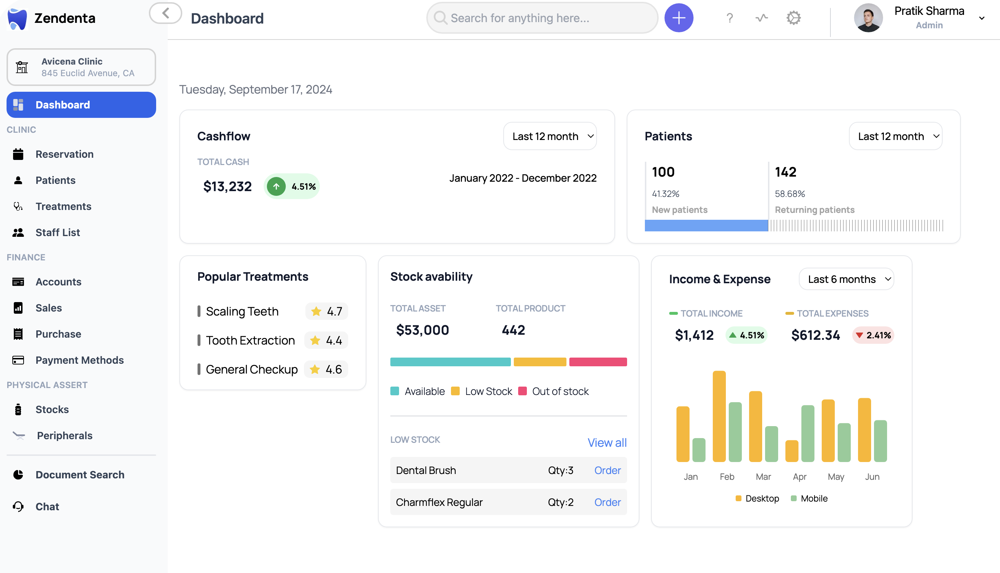

# Zendenta
Zendenta is a Dental clinic management Software, build to make scheduling, patient dashboard, doctor dashboard, customer support, chat and document intelligence. 




### 🚀 Objective
The goal is to build a full-featured platform that assists dental clinics in managing all aspects of their operations, from patient care to inventory management and financial reporting.

Features
Staff Management

Add and manage staff information, including doctors, general staff, and other employees.
Stock & Inventory Management

Add, manage, and track medical stocks and peripheral equipment.
Patient Management

Add patients and manage their details, including treatment plans and visit history.
Treatment Planning

Create and manage treatment plans with recurring visits and assigned doctors.
Appointment Scheduling

Schedule and manage patient appointments, including rescheduling capabilities.
Payments & Invoicing

Manage payment methods, invoice patients, and track clinic finances.


### Why Sass for dental Clinics
India boasts the second-highest number of dentists globally, in fact, India exceeds the WHO’s recommended dentist-to-population ratio of 1:1700 by a significant margin


The global dental market size was valued at USD 35.40 billion in 2023 and market is projected to grow from USD 38.95 billion in 2024 to USD 95.37 billion by 2032, exhibiting a CAGR of 11.8% during the forecast period (2024-2032). North America dominated the global market with a share of 38.81% in 2023 (https://www.fortunebusinessinsights.com/dental-market-106251)

What is the reason behind the increasing dental tourism in India?

A report by Insights10 reveals that India’s dental care market was valued at $653 Mn in 2022 and is estimated to expand at a compound annual growth rate (CAGR) of 9.40% from 2022 to 2030 and will reach $1339 Mn in 2030.


### 📝 How It Works
The platform is designed for both Indian and international dental clinics. In India, dental visits tend to be need-specific, while in other countries, regular visits are more common. The system will handle treatment plans that include services, payment schedules, and recurring visit dates. Each treatment plan will have an assigned doctor.

A clinic may have multiple doctors and patients, supported by general staff, medical equipment, and stock management. Patients pay for their treatments, and the system supports finance and invoicing management for clinics.

💻 Tech Stack
Frontend: React, Next.js, Tailwind CSS, Storybook
Backend: Convex for managing backend operations
Database: Convex for data storage and handling complex queries
🔧 Admin & Doctor Onboarding
Admin and doctor onboarding includes email, clinic name, and staff invitation functionalities.
Onboarding flow involves creating the clinic and inviting doctors or staff members via email.


# Turborepo starter

This is an official starter Turborepo.

## Using this example

Run the following command:

```sh
npx create-turbo@latest
```

## What's inside?

This Turborepo includes the following packages/apps:

### Apps and Packages

- `docs`: a [Next.js](https://nextjs.org/) app
- `web`: another [Next.js](https://nextjs.org/) app
- `@repo/ui`: a stub React component library shared by both `web` and `docs` applications
- `@repo/eslint-config`: `eslint` configurations (includes `eslint-config-next` and `eslint-config-prettier`)
- `@repo/typescript-config`: `tsconfig.json`s used throughout the monorepo

Each package/app is 100% [TypeScript](https://www.typescriptlang.org/).


### Build

To build all apps and packages, run the following command:

```
cd my-turborepo
pnpm build
```

### Develop

To develop all apps and packages, run the following command:

```
cd my-turborepo
pnpm dev
```

